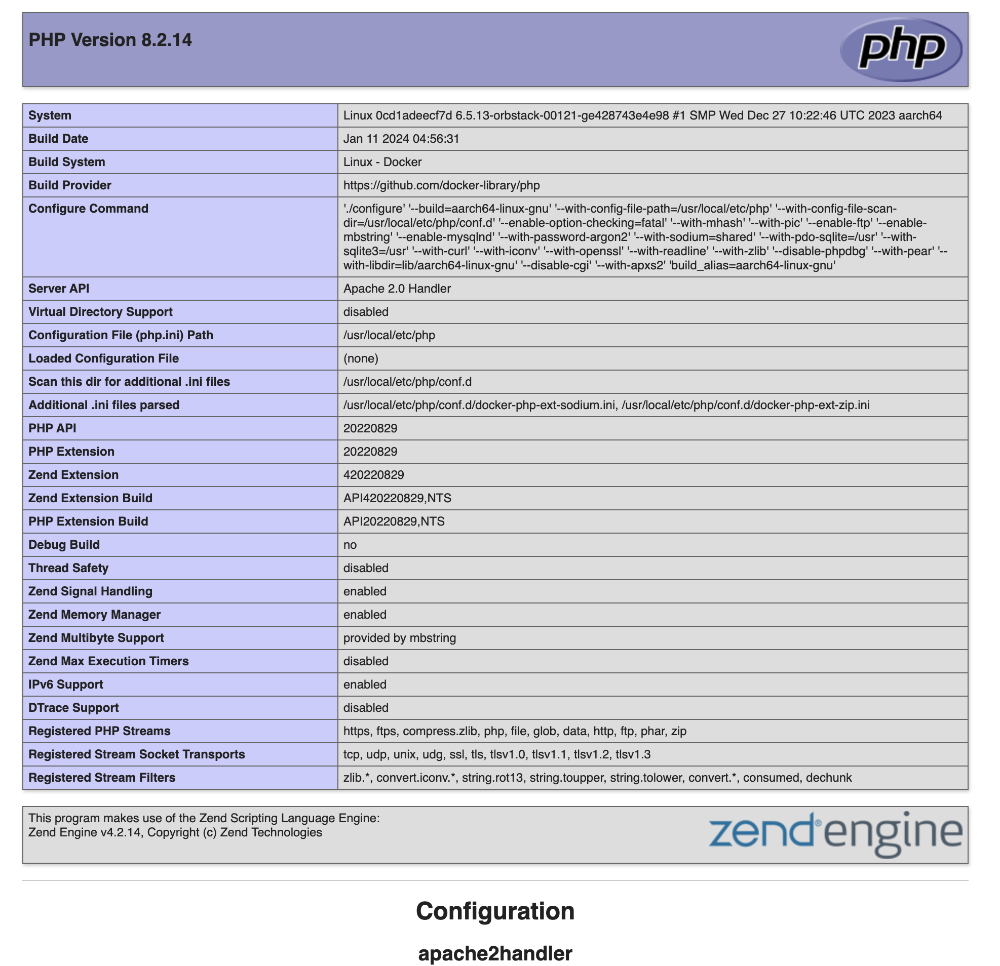

# ITAS 186 – Lab #1 PHP Development Environment Setup

Author: Bill Dou \
Email: bill.dou@itas.ca \
Updated on Jan 8, 2024

## Install Docker Desktop

1. Install Chrome
2. Install Docker Desktop

   - Go to https://www.docker.com/products/docker-desktop/
   - download the version for your OS and install it.

3. In your workspace, create a folder `itas186` and open it with VSCode.

4. Create a folder `php82.local` in `itas186`
5. In `php82.local` directory, create a file `Dockerfile` and add the following content:

```yml
FROM php:8.2-apache

# Install system dependencies
RUN apt-get update && apt-get install -y \
    libzip-dev \
    zip \
    unzip \
    git \
    vim

# Install PHP extensions
RUN docker-php-ext-install zip

COPY 000-default.conf /etc/apache2/sites-available/000-default.conf

# Copy your application code into the container
COPY . /var/www/html

# Expose port 80
EXPOSE 80
```
6. Copy file `000-default.conf` into `php82.local` folder.
7. Edit your 'hosts' file
   - `C:\Windows\System32\drivers\etc\hosts` (Windows)
   - `/etc/hosts` (MacOS) \
      and append the line:
     `127.0.0.1   php82.local`
   - MacOS `sudo vi /etc/hosts`

8. In `php82.local` directory, create a new file called `index.php` and add the following line:
   ```php
   <?php  phpinfo();
   ```
   Save the file.

9. Build the Docker image
   ```shell
   cd php82.local
   docker build -t php82-apache . 
   ```

10. Run docker container from the image
   ```shell
   docker run -d --rm -p 9000:80 -v $(pwd):/var/www/html --name php82_apache_container php82-apache
   ```
11. In your browser, go to http://php82.local:9000. You should see the a report of your php configuration!



Done.
