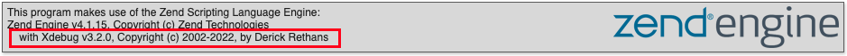
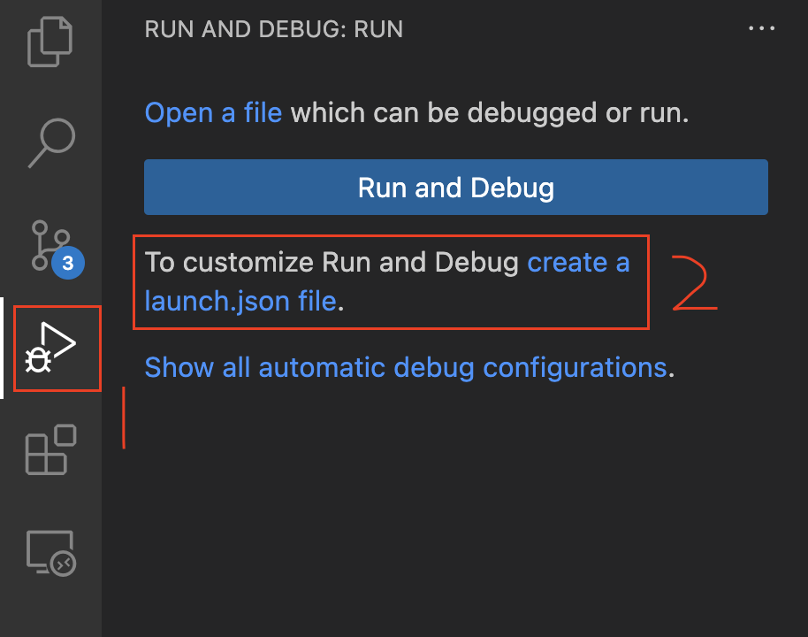
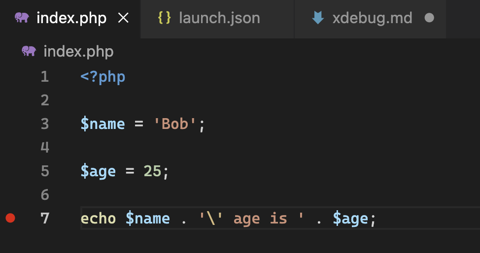
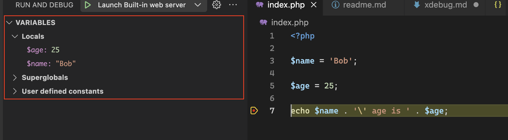
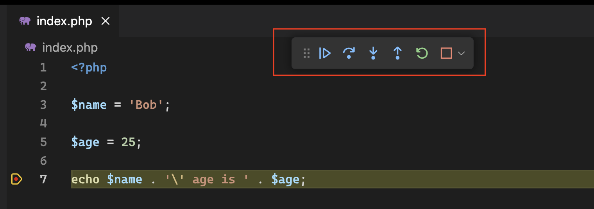

# Use Xdebug in PHP with VS Code

## Remove docker container(s)

Stop and remove containers created from php82-apache

## Remove docker image

Delete `php82-apache` image in docker desktop

## xdebug.ini

Create a new file `xdebug.ini` in root directory with following content:

```
[xdebug]
xdebug.mode=debug
xdebug.start_with_request=yes
xdebug.client_host=host.docker.internal  ; Use this if using Docker for Mac or Docker for Windows
xdebug.client_port=9003                  ; Adjust if needed
xdebug.idekey=VSCODE                     ; IDE key for the debugger (match with your IDE configuration)
xdebug.log=/var/log/xdebug.log           ; Optional: log Xdebug communication for debugging
```

## Update Dockerfile

Add following

```
# Install and enable Xdebug
RUN pecl install xdebug && docker-php-ext-enable xdebug

# Configure Xdebug
COPY docker/xdebug.ini /usr/local/etc/php/conf.d/
```

after

```
# Install PHP extensions
RUN docker-php-ext-install zip
```

## Build new docker image

In root directory:

```shell
docker build -t php82-apache .
```

## Create container based on new image

In root directory

MacOS:

```shell
docker run -d --rm -p 9000:80 -v $(pwd):/var/www/html --name php82_apache_container php82-apache
```

Windows:

CMD

```
docker run -d --rm -p 9000:80 -v %cd%:/var/www/html --name php82_apache_container php82-apache
```

Powershell:

```
docker run -d --rm -p 9000:80 -v ${PWD}:/var/www/html --name php82_apache_container php82-apache
```

## Verify the xdebug is installed

In index.php

```
<?php
phpinfo();
```

Make sure you have seen the Xdebug section on PHP info page (You can search "xdebug" on the page to verify it).


## Setup Xdebug plugin in VS Code

1. Install the ["PHP Debug"](https://marketplace.visualstudio.com/items?itemName=xdebug.php-debug) plug-in for VSCode made by Xdebug.
2. In your project, go to the debugger (arrow with the bug icon) and hit the 'create a launch.json file' link.



Choose PHP and a new launch configuration will be created for you.
Clear up all content and paste following:

```
{
    "version": "0.2.0",
    "configurations": [
        {
            "name": "Docker PHP Xdebug",
            "type": "php",
            "request": "launch",
            "port": 9003,
            "pathMappings": {
                "/var/www/html": "${workspaceFolder}"
            },
            "log": true,
            "ignore": ["**/vendor/**/*.php"],
            "serverReadyAction": {
                "action": "openExternally",
                "pattern": "\\bListening on (.*?)[\\n\\r]"
            },
            "stopOnEntry": false
        }
    ]
}
```

3. It's time to use xdebug.

   1. Create a test.php file in the root directory and add the following code:

      ```php
      <?php

      $name = 'Bob';

      $age = 25;

      echo $name . '\' age is ' . $age;
      ```

   2. Add a breakpoint on line "echo $name ..." like below:
      
   3. Click the debug button on left sidebar and choose "Docker PHP Xdebug" and then click start icon
      ![Start the debug process./start-debug.png "Start the debug process")
   4. A new browser tab should be opened automatically and it will be kept as loading status. In VSCode left sidebar, you should see the variables you just defined.
      
   5. Try the functionalities in xdebug floating bar:
      
